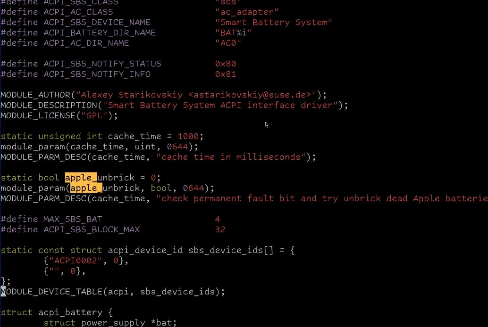

# Mineme
(MIN)imal colorsch(EME). Inspired by Rene Rebe

### Colors

Todo: this should be the new colors

Normal text: #a6a8aa
Background: #000000
Comments & preprocessor: #7b7684
Types and keywords: #f3bc5a
Strings: #3c4430
Search: #ffbb4a
Visual:

### Installing + Dependecies

It depens on [colorbuddy.nvim](https://github.com/tjdevries/colorbuddy.nvim)

To install with lazy.nvim:

    { "Alfurtx/mineme", dependencies = { "tjdevries/colorbuddy.nvim", branch = "dev" },init = function() require('mineme').setup() end }
